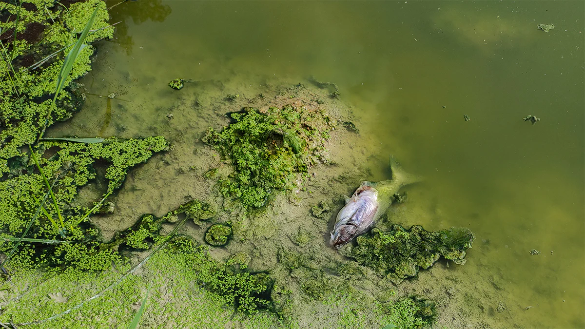

# Problem

[Key Terms](Problem/Key%20Terms%20296a34d0b03380649e8dee9d6f22e864.md)

[Bibliography](Problem/Bibliography%20296a34d0b03380ba996affec0eeb851c.md)

---

## Where it all begins - Harmful Algal Blooms

### What are they?

Harmful algal blooms (HABs) are like giant clouds of tiny algae, called phytoplankton, that grow out of control in the ocean, turning water red, green, or brown. Some algae make toxins or sticky gunk (AOM or TEP) that cause trouble for water plants. In 2025, HABs have intensified due to warmer oceans, pollution, and climate change, hitting coastal areas where desalination plants clean seawater for drinking. 

### How they cause trouble:

Globally, an estimated **16,000–23,000 desalination plants** operate today, with roughly **1,000–2,000 classified as large-scale SWRO facilities** capable of treating more than 100,000 m³/day.

During major HAB events, **organic loading** in feedwater can spike from baseline levels (< 10 mg/L) to **50–150 mg/L**, rapidly fouling RO membranes. Around **10 %** of large SWRO plants (roughly **150 facilities worldwide)** are likely affected each year by HAB-related shutdowns or performance declines.

A typical bloom lasts **five to ten weeks**, while individual plants may experience **4–15 days of downtime** per event for membrane cleaning and recovery. Cleaning cycles cost anywhere from **$500–$5,000** per incident depending on plant scale and chemical use.

### The Big Impact

To quantify the effect, we can model three realistic scenarios for a **1,000 m³/day plant**:

| Scenario | Downtime (days/event) | Water Lost (m³/event) | Cost Impact ($) |
| --- | --- | --- | --- |
| **Conservative** | 4 | 4,000 | 4,000 @ $1/m³ |
| **Typical** | 10 | 10,000 | 15,000 @ $1.5/m³ |
| **Severe** | 15 | 15,000 | 30,000 @ $2/m³ |

When scaled across roughly **150 affected plants**, the global water loss ranges between **0.4 and 3 million m³ per year**, representing **$0.4 – 6 million** in operational costs.

That’s enough potable water for **200,000 – 1.5 million people**, assuming 2 m³/person/year of desalinated supply in arid regions.

- HAB-affected Plants
    
    <aside>
    💡
    
    There are 16000-23000 SWRO plants in the world. We filter large plants because only large SWRO plants use PAC and DAF, and HABs only hit coastal/large SWRO plants. So to get the right number of HAB-affected plants that could use PAC, we:
    
    1. Start with ~1,000–2,000 large SWRO plants (the only ones with DAF/PAC systems).
    2. Then take 10% of those = 100–200 HAB-affected plants.
    </aside>
    

---

## Plants use PAC to combat HABs, but not enough.

### What is PAC?

Powdered activated carbon (PAC) is like a super sponge made from tiny grains of carbon that soak up the sticky gunk (AOM/TEP, 50–150 mg/L) and toxins (e.g., domoic acid, >10 µg/L) from HABs in seawater. In seawater pretreatment studies, PAC doses of **10–50 mg/L** have achieved **up to 70 % reduction** in organic load and **over 80 % toxin removal**, depending on contact time and water chemistry.

<aside>
💡

For a 1,000 m³/day plant hit by a HAB (4–15 days downtime), PAC cuts downtime by 20–30%. That saves 800–4,500 m³ of clean water per algal bloom. It’s a game-changer for keeping water flowing.

</aside>

- Why is PAC a smart choice to fight HABs?
    
    <aside>
    💡
    
    1. PAC is super cheap. It costs just $0.01–0.02/m³ to treat water, compared to Dissolved Air Flotation (DAF, $0.02–0.05/m³) or Ultrafiltration (UF, $0.05–0.15/m³). DAF uses bubbles to float gunk away but needs big tanks and energy (1–2 kWh/m³ vs. PAC’s 0.1–0.2 kWh/m³), while UF’s tight filters (0.01–0.1 µm) are great but pricey to install and maintain ($10,000–50,000/year for a 1,000 m³/day plant).
    2. PAC’s appeal lies in its simplicity: it can be mixed directly into existing pre-treatment trains, then filtered out by standard media or DAF units. That flexibility makes it particularly useful for **older plants built before 2010**, which comprise roughly **three-quarters of large SWRO facilities** globally.
    
    | Method | Typical Cost ($/m³) | Energy Use (kWh/m³) | Notes |
    | --- | --- | --- | --- |
    | **PAC Pretreatment** | 0.01 – 0.02 | 0.1 – 0.2 | Simple dosing, minimal hardware |
    | **DAF (Dissolved Air Flotation)** | 0.02 – 0.05 | 1 – 2 | Effective but large footprint, higher energy |
    | **UF (Ultrafiltration)** | 0.05 – 0.15 | 0.5 – 1 | Excellent quality, expensive installation |
    </aside>
    

### The Problem: Not Enough Plants use PAC.

Despite PAC’s benefits, only 10–20% of the 100–200 HAB-affected large SWRO plants (10–40 plants) use it. That means 90–160 plants miss out on saving 800–4,500 m³ per bloom, or 48,000**–720,000 m³/year** across 90–160 plants with one HAB event/year ($48,000–1,620,000 at $1–2/m³). Dosing PAC is tricky. It is like guessing the right amount of sugar for a giant cake, too much or too little messes things up because they rely on manual dosing. This pushes plants to stick with DAF or UF, even though they’re costlier.

---

## Plants are limited to manual-dosing, and it is bad.

PAC dosing automation sounds like the dream, but plants are limited to manual-dosing because of **4 big challenges**.

- Current Automations are unaffordable
    
    Current automated dosing systems cost $20K–50K per plant, too expensive for most. Smaller plants (1,000 m³/day) can’t justify the cost, and even larger ones hesitate due to high upfront investment.
    
- Complex Water Testing
    
    Checking algae gunk (AOM/TEP, >15 mg/L) and toxins (>10 µg/L) requires lab tests or expensive sensors ($10K–20K), which take hours and aren’t real-time. Workers use slow methods like jar tests to guess PAC doses.
    
- Lack of Expertise
    
    Many plants lack staff trained in automated systems, so they stick to manual dosing despite its flaws.
    
- Retrofit Challenges
    
    Older plants (70–80% of large SWRO, built pre-2010) weren’t designed for automation, making upgrades costly and complex.
    

<aside>
💡

Unable to transition to automated systems, manual dosing leads to mistakes and extra work. Of the 10–40 PAC-using plants, 90–95% (9–38 plants) rely on manual dosing. It causes errors (5–10% overdosing/underdosing) and wastes time (1–3 hours/day). This makes PAC seem unreliable, so most plants avoid it, missing out on saving 64,000–810,000 m³/year ($64K–1.62M at $1–2/m³) if half (40–90) adopted it.

</aside>

---

## But how bad is manual-dosing?

We broke down the water and cost wasted due to each causes. We also quantified the missed opportunity, showing that manual dosing is an urgent issue.

Manual dosing in 9–38 plants (90–95% of 10–40 PAC-using plants) causes:

- Overdosing: Wastes $9–292/plant/year ($81–11,096 across 9–38).
- Underdosing: Loses 9,000–76,000 m³/year ($9K–7.2M) due to 5–10% errors compounding's and leading to membrane clogging.
- Worker Hassle: Costs $720–4,380/plant/year for 36–219 hours on daily dosing adjustments and $6,480–166,440/year for 9-38plants.
- Sludge: Costs $216–876/plant/year ($1,944–33,288).
- Inconsistent Results: Loses 4,500–38,000 m³/year ($4.5K–76K).
- Equipment Wear: Adds $900–19,000/year.

| Inefficiency | Water or Cost Loss | Description |
| --- | --- | --- |
| Overdosing | + $100–300/yr | Wasted reagent and sludge disposal |
| Underdosing | − 9 000–75 000 m³/yr | Fouling-induced downtime |
| Labour Time | $700–4 000/yr | 1–3 h/day of manual prep |
| Equipment Wear & Sludge Handling | $1 000–5 000/yr | Increased cleaning frequency |

Even conservatively, manual dosing can waste **10 % of potential water recovery** in affected plants. That is equivalent to **10 000 m³/year per facility**, or **up to 100 000 m³/year** across a small regional cluster.

<aside>
💡

 That is enough for 57,000 people yearly.

</aside>

---

## The Gold Mine Opportunity.

Manual dosing is bad, but the bigger issue is 90–160 plants (80–90%) that avoid using PAC because it’s hard. If half (40–90) used PAC with an easier way (ie. Automated Dosing), they’d save 64,000–810,000 m³/year ($64K–1.62M). Fixing manual dosing in 9–38 plants saves 13,500–114,000 m³/year ($13.5K–228K) and $9,405–229,824/year. 

**Total: 77,500–924,000 m³/year ($77.5K–1.848M)**, helping 38,750–462,000 people.

<aside>
💡

An easier way saves water for up to 462,000 people!

</aside>

| Issue | Water Saved (m³/year) | Cost Saved ($/year) | People Helped |
| --- | --- | --- | --- |
| Fix Manual Dosing (9–38 plants) | 13,500–114,000m³ | $22,905–457,824 | 6,750–57,000 |
| Scale PAC (40–90 plants) | 64,000–810,000m³ | $64K–1.62M | 32,000–405,000 |
| Total | 77,500–924,000m³ | $77.5K–1.848M | 38,750–462,000 |

---

All research sources that informed this submission are listed in the bibliography page.

[Prototype](Problem/Prototype%20294a34d0b033808ca759cae749950128.md)

[Impact ](Problem/Impact%20297a34d0b0338054afaceb7ebb0dc210.md)

[Solution](Problem/Solution%20294a34d0b03380b68f88fe5b7db1965e.md)