# Solution

---

# The Smarter Way to Handle Blooms

When algal blooms hit, desalination plants often scramble to react. Operators guess how much powdered activated carbon (PAC) to add, hoping to catch the sticky organic matter before it clogs filters. But guessing isn’t good enough when each hour of downtime means thousands of litres lost (see problem page for more info).

<aside>
💡

Our solution replaces the guesswork with a **sensor-guided PAC auto-dosing system,** a simple add-on that makes dosing *responsive* instead of reactive.

</aside>

---

## How Auto-Dosing System Works (Step-by-Step)

Let’s start from the seawater intake and walk through how our solution operates:

```mermaid
graph TD
A["Intake Seawater"]:::input --> B["Sensors<br/>UV254 · Fluorescence · Chlorophyll-a · Turbidity"]:::sense
B --> C["Control Box<br/>Decides if bloom mode is ON/OFF<br/>Calculates PAC dose"]:::decide
C --> D["PAC Feeder<br/>Adds exact carbon dose into flow"]:::intervene
D --> E["Rapid Mix Tank<br/>PAC binds sticky organics (AOM/TEP)"]:::process
E --> F["DAF / Filters<br/>Bubbles skim out algae + PAC floc"]:::clean
F --> G["Reverse Osmosis<br/>Receives cleaner feedwater"]:::output
G --> H["Dashboard<br/>Logs signals, doses, and savings"]:::monitor

classDef input fill:#cce5ff,stroke:#1e88e5,color:#0d47a1;
classDef sense fill:#b3ffd9,stroke:#00a152,color:#004d40;
classDef decide fill:#fff3cd,stroke:#ffca28,color:#6d4c00;
classDef intervene fill:#f8bbd0,stroke:#e91e63,color:#880e4f;
classDef process fill:#ffe0b2,stroke:#f57c00,color:#4e342e;
classDef clean fill:#d1c4e9,stroke:#673ab7,color:#311b92;
classDef output fill:#c8e6c9,stroke:#4caf50,color:#1b5e20;
classDef monitor fill:#e0e0e0,stroke:#616161,color:#212121;
```

**In plain terms:**

- **1. Sensors detect what’s happening in the water.**
    
    – UV254, fluorescence, and chlorophyll-a readings show organic or algal activity.
    
- **2. The controller decides if conditions trigger bloom mode.**
    
    – If readings exceed set thresholds, the system switches from *normal* to *bloom* operation.
    
- **3. The controller calculates the precise PAC dose needed.**
    
    – Uses formulas that factor in how much higher organics and algae are above baseline.
    
- **4. The system doses and mixes the carbon, giving it time to bind the TEPs.**
    
    – PAC adsorbs the sticky organics before they reach the membranes.
    
- **5. DAF bubbles float the waste away, and RO membranes get cleaner feedwater.**
    
    – The treated water continues normally through RO.
    
- **6. Everything is logged and visible to operators.**
    
    – The dashboard shows when bloom mode was triggered, how dosing changed, and how water quality responded.
    

---

## Sensors: The “eyes” of the system

Each sensor tells a different part of the story:

| Sensor | What It Detects | Why It Matters |
| --- | --- | --- |
| **UV254** | How much organic matter is in the water | Directly tracks the “sticky stuff” PAC removes |
| **FDOM Fluorescence** | Biopolymers like AOM/TEP | Shows when slime levels rise even before water looks bad |
| **Chlorophyll-a / Phycocyanin** | Algal pigments | Tells us a bloom is starting—so we can act early |
| **Turbidity / SDI** | Cloudiness or fouling potential | Guardrail: alerts if things get too thick for PAC alone |

<aside>
💡

When these sensors detect abnormal readings, the controller switches the plant into **“bloom mode”**.

</aside>

---

## Bloom Mode Logic

Here is how the “Brain” of the system thinks, step by step:

1. **Detect:** Sensors pick up rising organics or algae levels.
2. **Decide:** If readings cross set thresholds, enter bloom mode.
3. **Dose:** Increase PAC gradually (never in big jumps) to catch the extra gunk.
4. **Check:** Safety rules stop overdosing and keep turbidity within limits.
5. **Log:** The dashboard shows what changed and why, so operators trust it.

---

## A Week in the Life of a Bloom

| Day | What’s Happening | What the System Does |
| --- | --- | --- |
| **Day 1** | Clear water, low organics | Normal mode, base PAC only |
| **Day 2–3** | Chlorophyll rising → bloom incoming | Auto bumps PAC slightly |
| **Day 4–6** | Peak organics (UV254 & FDOM spike) | PAC increases to capture AOM/TEP; RO stays clean |
| **Day 7–10** | Bloom fades | Doses taper smoothly down; no chemical waste |

Instead of reacting *after* membranes foul, the system adapts as the bloom evolves.

---

## Built-in Safeguards

- **Fallback Mode:** If any sensor fails, revert to a safe base dose.
- **Conflict Mode:** If readings don’t make sense (e.g., UV drops but turbidity spikes), freeze changes and ping the operator.
- **Safe Mode:** PAC dose changes slowly and within fixed limits, so no runaway automation.

---

## Retrofitting Is Easy

This solution is build with existing infrastructure in mind. Most desal plants already have:

- **A PAC feeder** (screw or eductor type)
- **Rapid mix and contact tanks**
- **DAF or UF pretreatment**

So we don’t build new infrastructure, we just **integrate our logic:**

- Mount sensors on existing sample lines
- Plug controller into feeder motor (0–10 V or 4–20 mA input)
- Set thresholds once and tune coefficients weekly
- Monitor from a small web dashboard

Think of it as installing cruise control on a car you already drive well.

---

## Why It’s Feasible Now

- **Sensors are cheap and rugged.** Sensors like UV254 absorbance and fluorescence monitors have become more affordable, with handheld meters under ~$1k–2k USD.
- **Automation is simple.** Even a Raspberry Pi or low-end PLC can run the dosing logic.
- **Retrofits are non-invasive.** Everything fits on existing pipes and panels.
- **Impact is measurable.** You can literally watch SDI and UV254 drop when the system is doing its job.

---

## The Bottom Line

Plants no longer need to fight HABs blindfolded.

Instead of waiting for fouling and shutdowns, they can **see** a bloom coming, **act** at the right time, and **save** water, money, and hours of cleanup. Everything with a few sensors and smarter dosing.

---

All research sources that informed this submission are listed in the bibliography page.